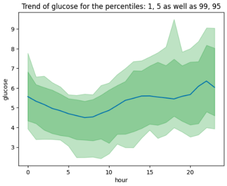
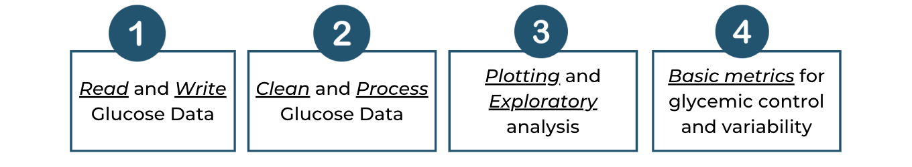
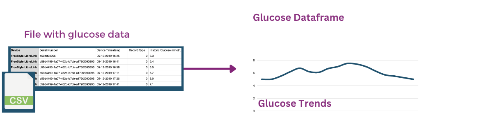

# Glyco - Analysing Continuous Glucose Data in Python
Glyco is a glucose data analysis Python library for glucose data analysis.

* ***Easy to setup:*** you can get started with glyco very fast. 
You can checkout the [Get started](Get%20started.ipynb) notebook for more.
* ***Easy to integrate:*** if you already have a workflow where you analyse glucose data. Glyco applies methods to pandas DataFrames, making it easy to integrate.

* ***Targeted for all kinds of glucose data:*** Glyco even handles glucose data for healthy individuals. Most of the metrics in CGM data are built based on CGM data for people with diabetes. This renders a lot of them useless when performing data analysis on healthy individuals (such as comparing the impact of meals and activities). Glyco has features to handle all types of glucose data, from all types of devices.

**Quick Example:**
```Python
import glyco as gl
# Read glucose file
df = gl.read_csv('examples/sample_glucose.csv')
# Plot glucose hourly trend
gl.plot_trend_by_hour(df)
```

## The easiest library to manipulate glucose data
*Glyco does not add any more complexity.*

If you are familiar with pandas dataframes, glyco makes use of pandas dataframe and does not introduce any new concepts or abstractions.

This makes it easy to use and integrate with your current workflows.
Reading your glucose file into a dataframe in glyco is as easy as:
```Python
import glyco as gl

glucose = gl.read_csv(file_path='my_glucose_data.csv')
```
This returns a glucose dataframe, takes care of: pre-processing the timestamps and dates, cleaning missing data, making the curve smoother and converting units.
## What you can do with Glyco
Glyco provides a range of features for handling continuous glucose data, as shown in the figure below:



1. **Read and Write glucose data** Glyco handles data from different sources including CSV files (such as FreeStyleLibre or DexCom) and dataframes, and using this data is as simple as:

    ```Python
    glucose = gl.read_csv(file_path='my_glucose_data.csv')
    ```
    You can find more in the [glucose documentation](docs/glucose.md).
2. **Clean and Process glucose data** you do not need to worry about missing values, errors and outliers. Glyco handles different types of cleaning and processing, so you can focus on analysing the data.
3. **Plotting and visual analysis (EDA)** to easily explore glucose data, and aid you in understanding patterns and trends.

    ```Python
    gl.plot_glucose(glucose) # Where 'glucose' is the dataframe containing glucose
    gl.plot_trend_by_weekday(glucose)
    gl.plot_trend_by_hour(glucose)
    ```
4. **Calculate metrics and statistics**  for each day, or week. These metrics are targeted for analysing healthy individual data (not diagnosed with diabetes). These metrics range from *general statistics (mean, percentiles etc.) to more advanced metrics (area under the curve for a day)*. And it's as simple as:
    ```Python
    # get metrics for each day
    day_metrics = gl.get_metrics_by_day(glucose)
    day_metrics = gl.get_metrics_by_day(glucose)
    ```
    Which results in a dataframe containing metrics such as: mean glucose, maximum glucose, standard deviation, area under the curve and more. To learn more about metrics, feel free to look at the [metrics documentation](docs/metrics.md).

Most inputs and outputs in Glyco are pandas dataframes. This means that you can use features of pandas on along with the ones provided by glyco.

## More things you can do with glyco
Glyco can also aid you in more advanced tasks such as detecting meals, comparing the impact of different meals or activities or any type of event. 


1. **Automatically infer Meals, or activities**, or other events that impact glucose.
    ```Python
    # you can detect events from variations in glucose
    events = gl.get_events_from_variations(glucose)
    ```
    Different methods are used for infering events. More on this in the [meals and events documentation](docs/meals_and_events.md).
2. **Provide events and match them to the glucose data** and analyse them to see how they impact glucose.
    ```Python
    # you can provide a list or dataframe that contains the event times
    events = gl.get_events(event_times)
    ```
    You can even get the events from a folder of pictures. More on this in the [meals and events documentation](docs/meals_and_events.md).
3. **Advanced analysis of events**, including metrics for meals or events and how they impact glucose. As well as ranking meals and more, to further aid in understanding the glucose data.

## Limitations
* The metric calculations for days assumes the device timezone is the user's timezone.

> ***Disclaimer*** Glyco is not a medical product and shall not be used to diagnose, treat or evaluate any medical conditions.
For more on the intended use and indications of use please read the [healthcare considerations document](docs/extra/healthcare.md).

## Built on the shoulders of giants
Glyco is built using the following libraries:
* Pandas and Numpy.
* Matplotlib and Seaborn.
* Rich for beautiful text displays.