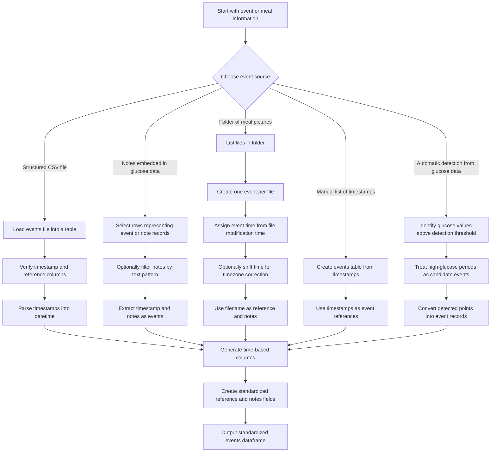

## The Events and Meals dataframes
> This is how glyco represents data about meals or other types of events such as: exercise, supplements, or other activities and interventions.

This is generated from either:
* A dataframe with meal times that contains: 
  * *Required* A timestamp column (datetime.Timestamp) (with both time and date)
  * *Optional* Notes column (str).
  * *Optional* Reference column (str) refers to a file or something that describes the meal in more details.
* A folder with meal pictures.

To generate the unified meals dataframe, glyco also requires: [**a unified Glucose dataframe**](glucose.md), if a folder is used a time delta must be provided in hours to correct the timezone if there is a timezone difference (This time delta is substracted: `timedelta = glucose device timezone - meal timezone`).

As a result `glyco` will generate a **Meals dataframe**, with:

* _original timestamp_
* _nearest glucose timestamp_
* Meal id
* Meal session
  * _estimated meal start timestamp_
  * _estimated meal end timestamp_
  * Meal session id
* *Optional*:
  * References if provided in the input (if a folder is used)
  * Notes if provided in the input
  * timezone difference
* Glucose stats:
  * Glucose max
  * Glucose min
  * Glucose average
  * Glucose standard deviation
  * Glucose 68th percentile
  * Glucose 95th percentile
  * Glucose 5th percentile
* Meal features:
  * Area Under the Curve
    * Above minimum
    * Above threshold
    * Above mean
  * Ingestion speed
  * Clearance speed
## How _glyco_ reads events and meals
Here is a summary of all the ways glyco can read events and meals, either from:
* A structured CSV file `read_events_csv` or from a dataframe using `read_events_df`.
* Notes embedded in Glucose data `` (such as Freestyle libre data's note column)
* Folder or meal pictures `read_meals_from_folder`: if you have a folder that contains pictures of meals where the timestamp is the time the picture was taken by a phone or other device.
* Manual list of timestamps `read_events_from_times`: where each time corresponds to an event or meal.
* Automatic detection from glucose data `get_events_from_glucose_excursions`: based on the times where glucose rises, events and meals can be inferred.

## Meal feature calculation
### Estimate quantity of glucose in the meal
Theoretically, the area under the curve of glucose is:
`AUC = Glucose ingested (exogenous, after digestion) - Glucose expenditure (used or stored) + Glucose produced (endogenous)`
We will use the following proxies:
* Area Under the Curve
  * `AUC_min` Above minimum
  * `AUC_mean` Above mean
  * `AUC_lim` Above a predefined threshold
  * `AUC_min_relative` Above the min of the event itself

This is mainly because we cannot estimate glucose expenditure or production.

This measure could be corrected later depending on the person's activity.

The `AUC` can also be used to estimate glucose expenditure & production in exercise if the meal is kept the same or no meal is consumed.

### Estimate stress to produce insulin (Speed of ingestion)
Theoretically, the speed of glucose ingestion is:
`Speed of the curve = Speed of glucose ingestion + Speed of glucose digestion - Speed of expenditure`

We will use the following proxies:
* `max_dG_dt` Ingestion speed
* `max_G` peak glucose 
* `max_T` time to reach the peak of glucose
* `ingest_rate_w` weighed ingestion estimate, where we give more weight to the peak vs. time to reach the peak:
```Python
def L(h, T):
    return np.sqrt(h**2 + T**2)

def Lexp(h, T):
    return np.sqrt(h**3 + T**2)

def Llog(h, T):
    return np.sqrt(h**2*np.log(h) + T**2)


def LT(h, T):
    return np.sqrt(h**2 + np.log(T)**2)
```

### Estimate of the body's processing of the glucose (Rate of expenditure)
Does not tell much about the meal, but the person's ability to handle that meal.

A person who's more insulin resistant will generally consume glucose at a slower rate.
* `min_dG_dt` consumption speed, drop of glucose
  * Note: TODO maybe we should get the absolute value instead (lower abs is worse)
* `diff_G` difference from baseline glucose and glucose at the end of the event. 
* `max_T` time to get back to the baseline before the mean
* `exp_rate_w` weighed expenditure estimate, where we give more weight to the time to reach the peak.
